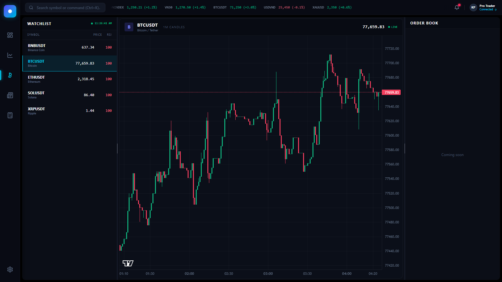
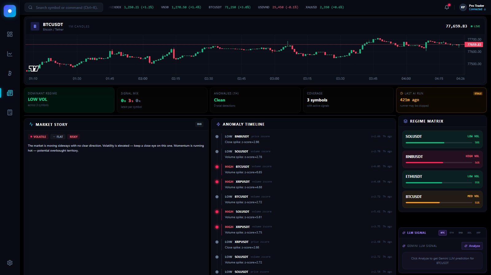
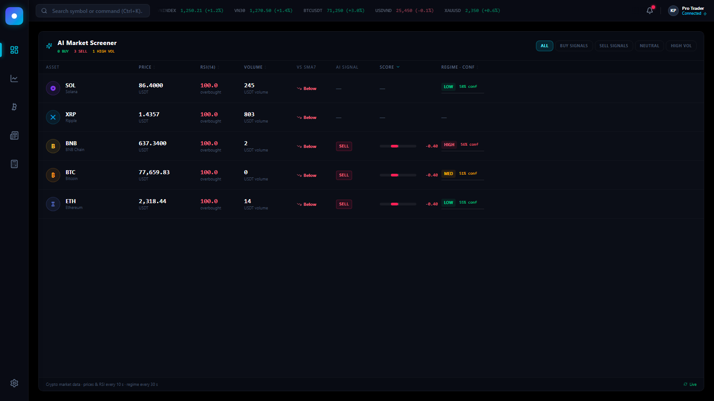
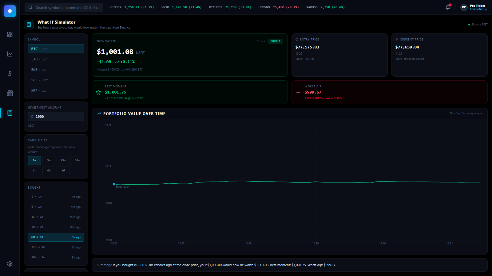
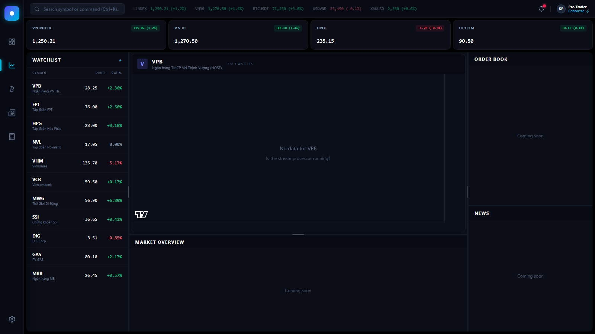

# XNO Quant — Market Data System

End-to-end crypto market data platform: real-time ingestion → feature engineering → AI post-processing → interactive dashboard. Built as an AI developer entrance test submission.

---

## Screenshots

### Crypto X — Live Candlestick Chart


> Live BTCUSDT 1-minute candlestick chart powered by Lightweight Charts. Left panel shows a live watchlist for 5 symbols (BTC / ETH / BNB / SOL / XRP) with real-time prices and RSI values fetched from the Go backend every 5 seconds. Clicking any row switches the chart instantly.

---

### Intelligence — AI Signal Dashboard


> The core analytical view. Top row is a **Market Pulse** bar with 5 summary cards (dominant regime, signal mix, anomaly count, coverage, AI freshness). Below that: **Signal Center** table (left), **Market Story** + **Anomaly Timeline** grid (bottom-left), and a right column with **Regime Matrix** (or Symbol Detail Drawer when a row is clicked) stacked above the **LLM Signal** card (always visible, powered by Gemini).

---

### AI Market Screener — Overview


> Live screener table for all 5 crypto symbols. Columns: asset icon + name, live price, RSI(14) with overbought/oversold color coding, volume (K/M suffix), position vs SMA7, AI signal badge, composite score bar (−1→+1), and regime badge with confidence bar. Filter pills (All / Buy signals / Sell signals / Neutral / High Vol) and sortable column headers.

---

### What If Simulator


> "If I had bought X amount Y candles ago, what would it be worth now?" — no AI, pure math on real Binance historical candles. Controls: symbol, USDT amount, candle size (1m/5m/15m/30m/1h/4h/1d), candles-ago, entry price mode (Open/High/Low/Close/Average). Results: current portfolio value, P&L in $ and %, best moment, worst dip, a Recharts portfolio-value line chart from entry to now, and a plain-English summary sentence.

---

### VN Equities — Shell


> Static VN equities visual shell with market index cards (VNINDEX / VN30 / HNX / UPCOM), a watchlist of VN stocks, and placeholder panels for Order Book, News, and Market Overview. Current real pipeline is crypto-focused; this tab represents the UI scaffold for a future Vietnam equities data source.

---

## Features in Detail

### 1. Real-Time Crypto Chart (`CRYPTO` tab)

The chart is built on **Lightweight Charts** (TradingView's open-source library) and receives data from the Go backend's `/api/v1/market/klines` endpoint.

| Behaviour | Detail |
|-----------|--------|
| Initial load | Fetches the last 200 candles, sorted ascending, and renders them all at once |
| Gap handling | Consecutive candle gaps ≤ 15 minutes are forward-filled with flat candles (same OHLC as the previous close) so the chart stays visually continuous during brief pipeline restarts |
| Live polling | Fetches the latest 5 candles every 15 seconds and calls `series.update()` — no full chart rebuild, no flicker |
| Symbol switching | Clicking a watchlist row triggers a full candle reload for the new symbol; the series is replaced cleanly |
| Price line | A dashed horizontal reference line tracks the current close price across the entire chart width |

---

### 2. Intelligence Panel (`NEWS` tab)

A decision-support dashboard split into several independent sub-components, all polling the backend's `/api/v1/ai/*` endpoints.

#### Market Pulse (top bar)
Five summary cards updated every 10 seconds:
- **Dominant Regime** — the most common regime across all tracked symbols (LOW / MED / HIGH volatility)
- **Signal Mix** — count of BUY / SELL / NEUTRAL signals across the latest reading per symbol
- **Anomalies (1h)** — count of HIGH and MEDIUM severity anomalies in the past hour
- **Coverage** — number of symbols that have at least one AI signal in the DB
- **Last AI Run** — how many minutes ago the latest signal was written; turns amber with a `STALE` badge if > 5 minutes

#### Signal Center (table)
Shows the most recent signal per symbol, sorted by absolute score strength. Each row shows:
- Symbol name
- Signal badge (`BUY` / `SELL` / `NEUTRAL`) and raw composite score
- Age of the signal (e.g. "3m ago")
- Plain-language reason ("RSI oversold + volume spike")

Clicking a row opens the **Symbol Detail Drawer** in the right column, which shows price, score breakdown bars (RSI / SMA / Volume components on a −1→+1 scale), market regime, and recent anomalies for that symbol.

#### Market Story
A non-technical narrative panel — no LLM, purely rule-based. It picks the symbol with the strongest signal (or whichever row was clicked) and derives three badges:

| Badge | Logic |
|-------|-------|
| **Mood**: Calm / Active / Volatile | From regime: `low_volatility` → Calm, `medium_volatility` → Active, `high_volatility` → Volatile. Falls back to recent anomaly severity if no regime data. |
| **Direction**: Up / Flat / Down | `close > sma7 × 1.002` → Up; `close < sma7 × 0.998` → Down; else Flat. Falls back to signal score if sma7 is null. |
| **Attention**: Normal / Watch Closely / Risky | Mirrors Mood. |

Then assembles 2–4 plain-English sentences from direction, regime, RSI level, and anomaly presence — e.g. *"Price is leaning upward in the short term. Volatility is elevated — keep a close eye on this one. Momentum is running hot — potential overbought territory."*

#### Anomaly Timeline
A vertical timeline of the latest 12 anomalies across all symbols, sorted newest-first. Each entry shows severity (HIGH / MEDIUM / LOW) with color-coded dot, symbol, anomaly type (e.g. `volume_zscore`), z-score, age, and a one-line description. HIGH severity anomalies pulse with a glowing red dot.

#### Regime Matrix
Shows the latest volatility regime for each symbol with a confidence percentage and a fill bar. Color coding: LOW VOL → green, MED VOL → amber, HIGH VOL → red.

#### LLM Signal Card (Gemini)
Always visible at the bottom of the right column. Has its own symbol selector (BTC / ETH / BNB / SOL / XRP buttons). Clicking **Analyze** sends the current price, RSI, algorithmic signal score, regime, and recent anomalies to the Gemini 2.5 Flash API and displays the structured response: `SIGNAL`, `CONFIDENCE`, `REASONING`, `RISK`. Requires `VITE_GEMINI_API_KEY` in `.env`.

---

### 3. AI Market Screener (`OVERVIEW` tab)

A live screener table that merges three backend data sources on the frontend:

| Column | Source endpoint | Notes |
|--------|-----------------|-------|
| Price | `/api/v1/market/overview` | Live close price |
| RSI(14) | `/api/v1/market/overview` | Green < 30 (oversold), Red > 70 (overbought) |
| Volume | `/api/v1/market/overview` | Formatted with K / M / B suffix |
| vs SMA7 | `/api/v1/market/overview` | Above ↑ or Below ↓ the 7-period SMA |
| AI Signal | `/api/v1/ai/signals` | BUY / SELL / NEUTRAL badge (latest per symbol) |
| Score | `/api/v1/ai/signals` | Centered bar from −1 to +1 |
| Regime · Conf | `/api/v1/ai/regime` | LOW / MED / HIGH badge + confidence fill bar |

Filter pills narrow the table to specific signal types or high-volatility symbols. All column headers are clickable to sort ascending/descending. Polls every 10 seconds for prices and signals, 30 seconds for regime.

---

### 4. What If Simulator (`SIMULATOR` tab)

Answers the question *"If I had bought crypto at some point in the past, how much would it be worth right now?"* No AI, no LLM — just real OHLCV data from **Binance REST API** (`/api/v3/klines`), fetched directly from the browser (public endpoint, no API key required).

**Controls:**

| Control | Options |
|---------|---------|
| Symbol | BTCUSDT, ETHUSDT, BNBUSDT, SOLUSDT, XRPUSDT |
| Investment amount | Any positive USDT value (default: 1,000) |
| Candle size | 1m, 5m, 15m, 30m, 1h, 4h, 1d |
| Bought X candles ago | 1, 5, 15, 30, 60, 120, 200 — displayed as human duration (e.g. "60 × 1h → 60h ago") |
| Entry price mode | Open, High, Low, Close, Average `(O+H+L+C)/4` |

**Computed results:**

- **Now Worth** — `quantity × current_close` where `quantity = amount / entry_price`
- **P&L** — absolute ($) and percentage
- **Best Moment** — `quantity × max(high)` across all candles from entry to now
- **Worst Dip** — `quantity × min(low)` across all candles from entry to now
- **Portfolio chart** — Recharts `LineChart` of portfolio value at each candle's close price, from entry to current candle. A dashed break-even reference line sits at the invested amount. Entry point is marked with a cyan dot.
- **Plain-English summary** — e.g. *"If you bought BTC 60 × 1h candles ago at the close price, your $1,000.00 would now be worth $1,037.25. Best moment: $1,052.40. Worst dip: $982.10."*

With `1d` candles and `200 candles ago` the simulator reaches ~200 days into the past.

---

## Architecture

```
                                                    ┌──────────────────────────┐
                                                    │ Frontend                 │
                                                    │ React + Vite :5173       │
                                                    │ Charts · Intelligence    │
                                                    │ Screener · Simulator     │
                                                    └────────────┬─────────────┘
                                                      /api proxy │ │ Binance REST
                                                    ┌────────────▼─┘           │
                                                    │ Go Backend               │
                                                    │ Fiber :8080, raw SQL     │
                                                    └────────────┬─────────────┘
                                                                 │ ClickHouse SQL
                               ┌─────────────────────────────────▼──────────────┐
Binance WS ──► Producer ──► Kafka (Aiven) ──► Processor ──► ClickHouse Cloud   │
  kline_1m      aiokafka       SSL/TLS         Pandas        market_klines     │
                                              micro-batch     market_latest     │
                                              AI Runner ───► market_ai_signals │
                                                             market_anomalies   │
                                                             market_regimes     │
                               └────────────────────────────────────────────────┘
```

The Simulator tab bypasses the backend entirely and calls `https://api.binance.com/api/v3/klines` directly from the browser (public CORS-enabled endpoint).

---

## Tech Stack

| Layer | Technology | Purpose |
|-------|------------|---------|
| Data Source | Binance WebSocket + REST | 1m real-time stream + Simulator historical candles |
| Message Broker | Kafka on Aiven | SSL/TLS, consumer groups, at-least-once delivery |
| Stream Processor | Python + Pandas | Micro-batch Kafka → features → ClickHouse |
| OLAP Database | ClickHouse Cloud | `ReplacingMergeTree`, materialized views |
| AI Layer | Python + scikit-learn | Signal scoring, anomaly detection, regime classification |
| Backend API | Go + Fiber v3 | Raw SQL via `database/sql` + `clickhouse-go/v2` |
| Frontend | React + Vite + Tailwind | Lightweight Charts, Recharts, resizable panels |
| DevOps | Docker + docker-compose | Service packaging and local orchestration |

---

## Quick Start

### Option A — Docker (recommended)

```bash
cd fullstackAI
cp .env.example .env          # fill in Aiven and ClickHouse credentials
# place Aiven SSL files in jobs/:  ca.pem  service.cert  service.key

docker-compose up -d
npm install && npm run dev    # http://localhost:5173
```

### Option B — Individual terminals

```bash
# Terminal 1 — Producer (Binance WebSocket → Kafka)
cd jobs/src && python -m stream.producer

# Terminal 2 — Processor (Kafka → ClickHouse, Pandas micro-batch)
cd jobs/src && python -m stream.processor_standalone

# Terminal 3 — AI Runner (signals, anomalies, regimes → ClickHouse)
cd jobs/src && python -m ai.runner

# Terminal 4 — Backend API
cd backend && go run ./cmd/main.go

# Terminal 5 — Frontend
npm run dev                   # http://localhost:5173
```

> Full environment variable reference and cloud setup are in [`SETUP_GUIDE.md`](SETUP_GUIDE.md).

---

## API Reference

### V1 — Market Data + AI

| Method | Path | Returns |
|--------|------|---------|
| GET | `/api/v1/ping` | Version + status |
| GET | `/api/v1/market/symbols` | List of tracked symbols |
| GET | `/api/v1/market/overview` | Latest price, volume, SMA7, RSI14 per symbol |
| GET | `/api/v1/market/klines?symbol=BTCUSDT&limit=200` | OHLCV + feature columns |
| GET | `/api/v1/ai/signals` | Composite signal scores (BUY / SELL / NEUTRAL) |
| GET | `/api/v1/ai/anomalies` | Detected anomalies with z-score and description |
| GET | `/api/v1/ai/regime` | Volatility regime + confidence per symbol |

### V2 — Portfolio Scaffold (mock)

| Method | Path | Returns |
|--------|------|---------|
| GET | `/api/v2/portfolio/summary` | Mock portfolio summary |
| GET | `/api/v2/portfolio/positions` | Mock positions list |

---

## AI Models

All models are lightweight, interpretable, and run as a periodic Python job — not real-time ML inference.

| Model | Technique | Output |
|-------|-----------|--------|
| Signal Scoring | RSI + SMA crossover + volume z-score → weighted composite | `BUY` / `SELL` / `NEUTRAL` + score in [−1, +1] |
| Anomaly Detection | Z-score (price + volume) + IsolationForest | Severity (`low` / `medium` / `high`) + description |
| Regime Classification | Rolling volatility percentile | `low_volatility` / `medium_volatility` / `high_volatility` + confidence |

---

## ClickHouse Schema

```sql
-- Real-time stream storage
market_klines_stream   ENGINE ReplacingMergeTree(ingestion_time)   ORDER BY (symbol, timestamp)
market_latest_price    ENGINE ReplacingMergeTree(ingestion_time)   ORDER BY (symbol)

-- AI output tables
market_ai_signals      ORDER BY (symbol, timestamp)
market_anomalies       ORDER BY (symbol, timestamp, type)
market_regimes         ORDER BY (symbol, timestamp)
```

Queries use `FINAL` for deduplicated reads. Dedup via background merge on the `version` column (`ingestion_time`).

---

## Validation

```bash
npm run build                        # frontend TypeScript + Vite build
cd backend && go build ./...         # Go backend compilation check
cd jobs && python -m compileall -q src  # Python syntax check
```

---

## Documentation

| File | Content |
|------|---------|
| [`SETUP_GUIDE.md`](SETUP_GUIDE.md) | Aiven Kafka, ClickHouse Cloud, Docker, and local startup |
| [`TRADE_OFFS.md`](TRADE_OFFS.md) | Architecture decisions and alternatives considered |
| [`CLICKHOUSE_DEEP_DIVE.md`](CLICKHOUSE_DEEP_DIVE.md) | ClickHouse internals and query patterns |
| [`AI.md`](AI.md) | AI tool attribution log |
